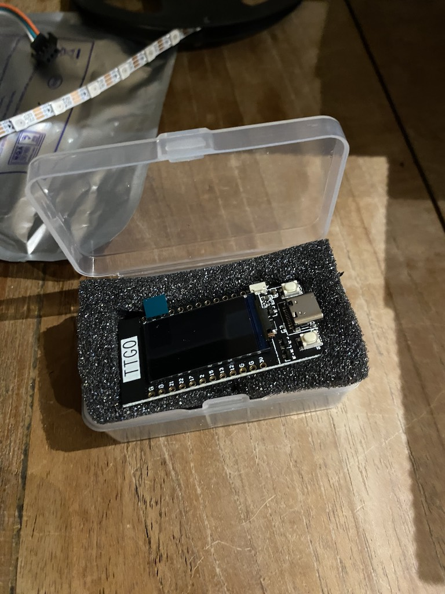

# dojocon-micropython
Workshop micropython for Dojocon Belgium

This repo contains the content of a workshop for Dojocon Belgium 2023, a [CoderDojo Belgium](https://www.coderdojobelgium.be) conference for and by the volunteers.

Goals of this workshop:

1. For those new to hardware/electronics, it will be a gentle introduction the this wonderfull world
1. For those having some experience with Arduino, I hope the workshop will provide some hands-on experience to how the interactivity of micropython lowers the learning curve to start with hardware/electronics

# Our Project
In this workshop, we will automate the Chrome dino game using a servo that presses the space bar, and a light dependend resistor. We'll use micropython the do the coding and benefit from the interactivity of the python REPL to figure out the settings for our servo and resistor.


# Before we start - your dev environment
Before we can start, we'll need some things to setup.

## Editor
We'll need an editor to write our python code and to interact with our microcontroller.

Feel free to use whatever editor you like, for dojo's I highly recommend (Thonny)[https://thonny.org/], the Python Editor for beginners. You'll find download links for your platform on the home page.

## Hardware
We'll use an ESP32-based board, the ttgo t-display.


I like this board because it is inexpensive, has a display, has 2 physical buttons and has a 5V pin. Mind that the ESP32 runs on 3.3V, and all the I/O pins can only deal with 3.3V, 5V might fry your board. The 5V will only work if the ESP32 is powered by USB, and is ideal to power Neopixels or servo's. For steering those, a PWM signal of 3.3V is enough, so driving them with this board is perfectly possible.

You might need to install a specific driver. On Windows I saw little to no problems (caveat, I don't have a windows machine myself, many of our ninja's have...), on Mac, you need to install a specific driver, that can be found at https://github.com/Xinyuan-LilyGO/TTGO-T-Display. 

Once the driver is installed, you might see the microcontroller pop up twice in your list of connected devices as
```
/dev/cu.usbmodem<some numbers and letter here>
```
or as
```
/dev/cu.wchusbserial<letters and numbers>
```
It's the last one you'll need.

## Micropython
We need to install, or *flash* micropython on the microcontroller. You can find ready made binaries on the [Micropython](https://micropython.org/) site in the download section.

If you want to use the display of this board, you'll need a special firmware, since the driver for this display is written in c/c++ with python bindings. (note: In this workshop, we will not be using the display)

So download the firmware at: https://github.com/russhughes/st7789_mpy/blob/master/firmware/T-DISPLAY-ESP32/firmware.bin

Flashing the firmware can be done from within Thonny.

1. Connect the ESP32 via a USB-C cable to your computer
1. Fire up Thonny
1. In the  __Run__ (uitvoeren) menu, choose __Configure Interpreter__
1. Choose MicroPython (ESP32)
1. In the same dialog, click __install or update MicroPython__ at the bottom right of the dialog box
1. Choose the port at which your ESP32 is connected and select the firmware.bin file you just downloaded. Don't forget the choose the right one (see above)
1. Click install. This might take a one to two minutes to complete

Once flashed, you can connect Thonny to the ESP32 by clicking on the lower right hand side corner of Thonny. You should see MicroPython (ESP32) * Port there...

Once clicked, you will get access to a REPL, an interactive Python shell that is actually running on the ESP32. In there, you can import module or run python code interactively.

# Let's start developing

## The Electronics
For this project, we'll need:

- an ESP32
- a simple servo
- an LDR - light dependent resistor - the more light, the lower the resistance
- a 10kΩ resistor
- jumperwires
- some tape

Here's a schema of the entire project. 


Don't start building this entire schema just yet, we'll take it one step at the time ;)

## Step 1: Using a servo

```
Important: when fiddling with wires, always disconnect the ESP32!
```

Start with building the servo-related part of the schema.

Servo's typically need 5V (red wire), a ground (black wire) and a PWM signal (yellow wire).

Use pin 2 for the signal.

Once built, connect the ESP32 via USB again.

MicroPython does not have a servo class (it does have a PWM class), feel free to either figure out how servo's and PWM works, or use [servo.py](src/servo.py)

```python:src/servo.py
```


## Step 2: Using an LDR (Light Dependent Resistor)

## Bringing it all together

# Wrapping up

